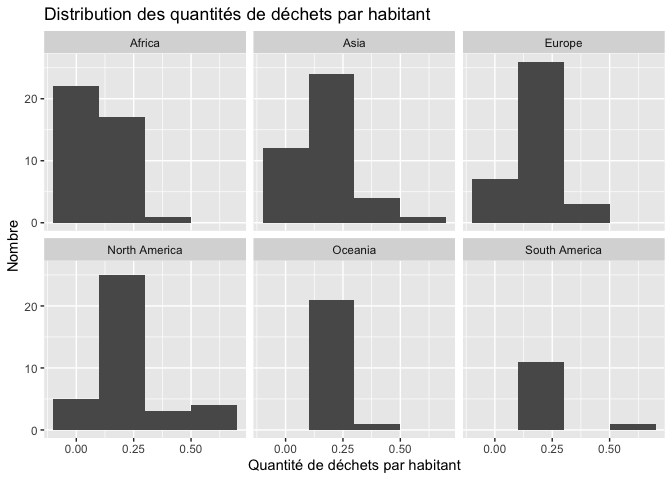
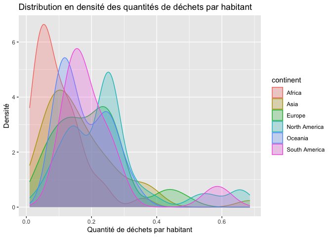
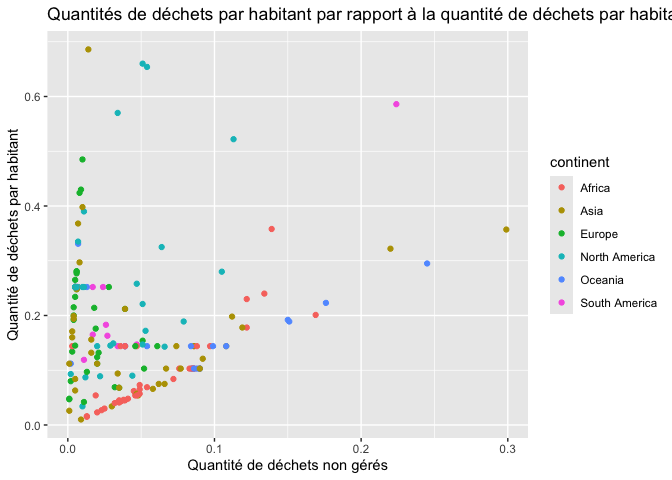

Lab 02 - Plastic waste
================
Alice Thibault
16 septembre 2025

## Chargement des packages et des données

``` r
library(tidyverse) 
```

``` r
plastic_waste <- read_csv("data/plastic-waste.csv")
```

Commençons par filtrer les données pour retirer le point représenté par
Trinité et Tobago (TTO) qui est un outlier.

``` r
plastic_waste <- plastic_waste %>%
  filter(plastic_waste_per_cap < 3.5)
```

## Exercices

### Exercise 1

``` r
ggplot(data=plastic_waste %>% filter(plastic_waste_per_cap < 3.5), aes(x=plastic_waste_per_cap)) +
geom_histogram(binwidth=0.2) + facet_wrap(~continent) + labs(title = "Distribution des quantités de déchets par habitant" , x= "Quantité de déchets par habitant", y= "Nombre")
```

<!-- --> On
voit que pour l’Afrique, l’Asie, l’Europe et l’Amérique du nord, la
quantité de déchets par habitant est plus faible pour la majorité de la
population. Pour ce qui est de l’Océanie et l’Amérique du sud, la
quantité de déchets produits par habitant est plus élevé pour la
majorité de la population.

### Exercise 2

``` r
ggplot(data=plastic_waste %>% filter(plastic_waste_per_cap < 3.5), aes(x=plastic_waste_per_cap, color=continent,fill=continent)) + geom_density(alpha=0.25) + labs(title = "Distribution en densité des quantités de déchets par habitant" , x= "Quantité de déchets par habitant", y= "Densité")
```

<!-- -->
Décrivez pourquoi le reglage de la couleur (color et fill) et le réglage
de la transparence (alpha) ne se trouvent pas au même endroit ? L’un
étant réglé dans aes et l’autre dans geom_density()

Les réglages color et fill sont dans aes, car ils dépendent des
variables et modifient leur présentation visuelle. Pour le paramètre
alpha, ce dernier est placé dans geom_density, puisqu’il agit sur la
transparence de la couleur sur graphique directement et non sur la
variable choisie.

### Exercise 3

Boxplot:

``` r
ggplot(data=plastic_waste %>% filter(plastic_waste_per_cap < 3.5), aes(x=continent, y=plastic_waste_per_cap)) + geom_boxplot() + labs(title = "Quantités de déchets par habitant par continents" , x= "Continents", y= "Quantité de déchets par habitant")
```

<!-- -->

Violin plot:

``` r
ggplot(data=plastic_waste %>% filter(plastic_waste_per_cap < 3.5), aes(x=continent, y=plastic_waste_per_cap)) + geom_violin() + 
labs(title = "Quantités de déchets par habitant par continents" , x= "Continents", y= "Quantité de déchets par habitant")
```

<!-- -->

Qu’est ce que les violin plots permettent de voir sur les données que
les boxplot ne permettent pas ?

Les violoins plots permettent de voir une meilleure répartition des
données tandis que les boxplots permettent seulement de voir des
résultats comme la médiane, les quartiles et les données extrêmes qui ne
sortent de la boîte.

### Exercise 4

``` r
ggplot(data=plastic_waste %>% filter(plastic_waste_per_cap < 3.5), aes(x=mismanaged_plastic_waste_per_cap, y=plastic_waste_per_cap, color=continent)) + geom_point() + labs(title = "Quantités de déchets par habitant par rapport à la quantité de déchets par habitant qui sont non gérés" , x= "Quantité de déchets non gérés", y= "Quantité de déchets par habitant")
```

<!-- -->

On voit la relation entre les déchets qui sont produit et comment ils
sont gérés. On voit bien que pour ce qui est de l’Afrique, la majorité
des déchets qui sont produits sont mal gérés, mais qu’à l’inverse, la
majorité des déchets produits par l’Europe sont bien gérés. On voit
qu’entre les deux de ces extrémités, l’Amérique du nord a environ la
moitié de ses déchets produits qui sont mal gérés et que l’autre moitié
produites est bien gérées. Le graphique montre bien la répartition des
déchets bien et mal gérés par les différents pays.

### Exercise 5

``` r
ggplot(data=plastic_waste %>% filter(plastic_waste_per_cap < 3.5), aes(x=plastic_waste_per_cap, y=total_pop,color=continent)) + geom_point() + labs(title = "Quantités de déchets par habitant par rappport à la population totale" , x= "Quantité de déchets par habitant", y= "Population totale")
```

    ## Warning: Removed 10 rows containing missing values or values outside the scale range
    ## (`geom_point()`).

<!-- -->

``` r
ggplot(data=plastic_waste %>% filter(plastic_waste_per_cap < 3.5), aes(x=plastic_waste_per_cap, y=coastal_pop, color=continent)) + geom_point() + labs(title = "Quantités de déchets par habitant par rappport à la population côtière" , x= "Quantité de déchets par habitant", y= "Population côtière")
```

<!-- -->

On voit sur le deuxième graphique qu”il y a plus de pays situées sur le
bord de l’eau où la population a moins tendance à produire beaucoup de
déchets par habitant que si l’on regarde le graphique contenant
l’entièreté de la population.

Sur le premier graphique, la taille totale de la population ne semble
pas expliquer directement la quantité de déchets plastiques produites
par habitant. Toutefois, sur le deuxième graphique, on considère
seulement la population côtière et on voit que les pays avec de très
grandes populations côtières produisent généralement moins de déchets
plastiques par habitant. Il y a plus de point vers le haut du graphique.

## Conclusion

Recréez la visualisation:

``` r
ggplot(data=plastic_waste %>% mutate(coastal_pop_prop = coastal_pop / total_pop)%>% filter(plastic_waste_per_cap < 3), aes(x=coastal_pop_prop, y=plastic_waste_per_cap, color=continent)) + geom_point()+ geom_smooth(method = "loess",se = TRUE,color = "black",fill = "grey")+ labs(title = "Quantité de déchet plastique vs la Proportion de la population côtière" ,subtitle = "Selon le continent", x= "Proportion de la population côtière (Coastal/total population)", y= "Nombre de déchets plastiques par habitant")
```

    ## `geom_smooth()` using formula = 'y ~ x'

    ## Warning: Removed 10 rows containing non-finite outside the scale range
    ## (`stat_smooth()`).

    ## Warning: Removed 10 rows containing missing values or values outside the scale range
    ## (`geom_point()`).

<!-- --> Interprétation
En regardant la courbe de tendance, on peut conclure que plus la
proportion de la population côtière augmente, plus le nombre de déchets
produits par habitant augmente, mais très légèrement. Justement, puisque
la variation de la ligne n’est pas très grande, on peut aussi conclure
que la relation entre les deux variable n’est pas super forte. Il y a
une variation, mais elle n’est pas très grande. On peut voir que pour le
continent de l’Afrique, les point se situent majoritairement dans une
faible quantité de déchet peu importe l’emplacement de la ville et que
pour l’Amérique du nord, l’Europe et l’Asie, la majorité des quantités
de déchet par habitant est plus élevé et s’éloigne de la courbe de
tendance.
